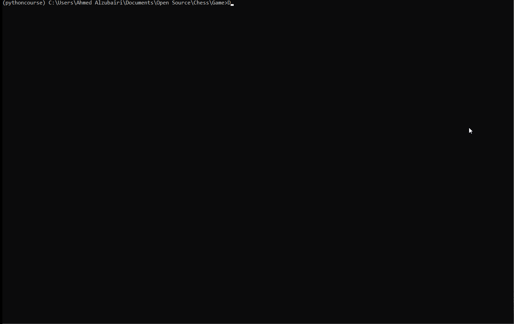

# Chess

[](https://travis-ci.org/AhmedAlzubairi1/Chess)
[](https://codecov.io/gh/AhmedAlzubairi1/Chess)
[](https://chess1.readthedocs.io)
[![Personal Website] (https://img.shields.io/badge/<LABEL>-<MESSAGE>-<COLOR>)] (https://ahmedalzubairi1.github.io/ahmedalzubairi.github.io/)
https://ahmedalzubairi1.github.io/ahmedalzubairi.github.io/
COMS4995 Project -> Chess Backend


This is repo for a chess backend that you can use for your chess game. All you need to do is to handle the front end. Everything else such as the rules of the game and movement is already handled by the backend. 


To run the sample terminal front end of the game do : 
python Game/gameRunner.py

When playing the game. This is how you move a piece:
If you want to move a piece at 1A to 3B, just type : 1A to 3B
The game would shift between players so that each player gets a turn until someone wins. 


When creating your frontend, you would need to copy the logic in the terminalGame.py file. Specifically you need to use the initGame, function to start the game. THen you can use whatever frontend you want to make the chess game.

To run the game on the terminal front end, go to the Game directory and run the python script gameRunner.py as such:

```
cd Game
python gameRunner.py
```
Follow the instructions to move pieces. First to get a check mate wins.
To demo The chess engine on the front end w/ terminal interface:

